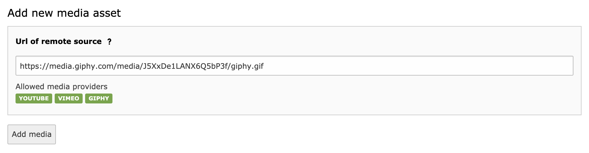
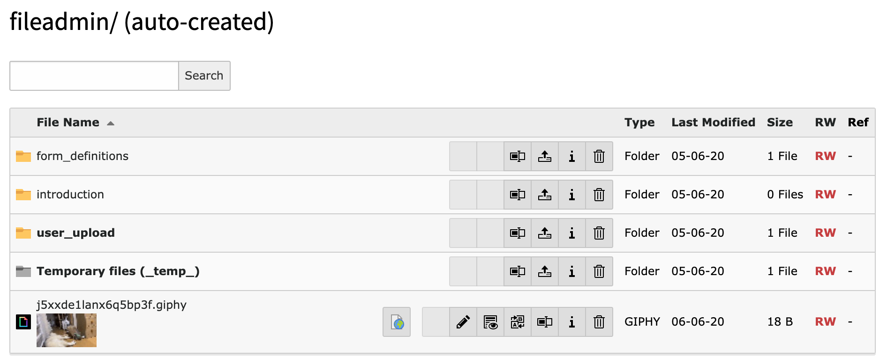
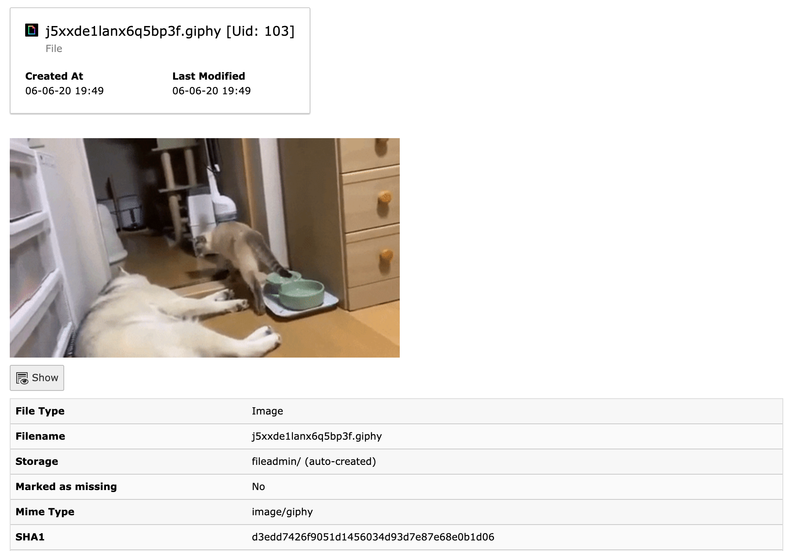
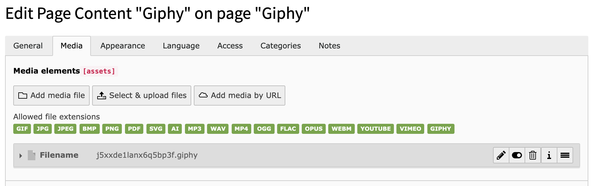

.. ==================================================
.. FOR YOUR INFORMATION
.. --------------------------------------------------
.. -*- coding: utf-8 -*- with BOM.

.. include:: ../Includes.txt

.. _introduction:

Introduction
============

This chapter gives you a basic introduction about the TYPO3 CMS extension “spotify”.

.. _what-it-does:

What does it do?
----------------

A wrapper to let you add spotifys to your site.
This extension will give you the possibility to add spotifys to TYPO3.

Screenshots
-----------

   Add new asset

   File list

   File info

   Plugin add reference
